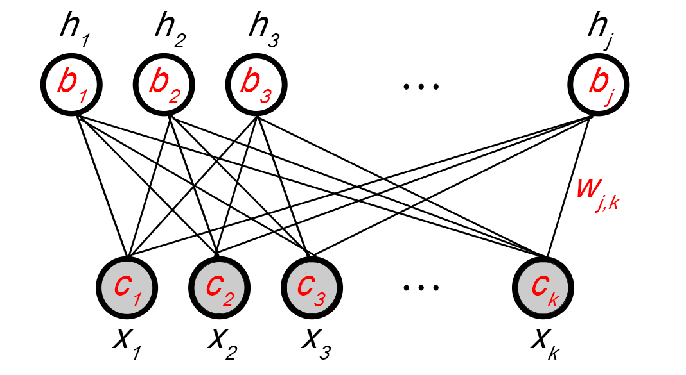

# AI Deep Learning DJ
--


## Overview
Artificially Intelligent DeepLearning Python DJ powered by Google TensorFlow and using Restricted Boltzmann Machine to generate music you show it.




## Dependencies

* [tensorflow](https://www.tensorflow.org/versions/r0.10/get_started/os_setup.html)
* pandas
* numpy
* msgpack
* glob
* tqdm 

## Get Started

1) Install project requirements


```
pip install -r requirements.txt
```

2) Drop in music files

The training data goes in the midi_data folder. You have to use MIDI files. 


3) Run script

```
python music_generator.py
```

 The output will be a collection of midi files. 


## Credits

- OG2 [siraj](https://github.com/llSourcell/Music_Generator_Demo)
- OG1 [dshieble](https://github.com/dshieble) 
